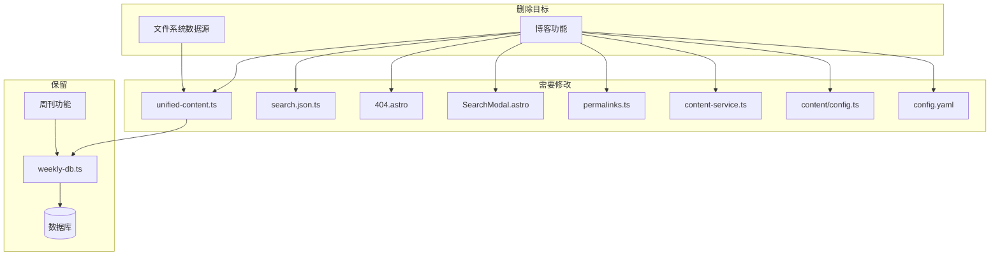

# 项目架构简化规划

> 创建时间: 2025-12-09
> 状态: 待确认

## 一、项目概述

### 1.1 当前问题

1. **双数据源架构复杂**: 同时支持文件系统和数据库两种数据源，增加了代码复杂度
2. **Blog/Weekly 共存困难**: 两种内容类型格式难以统一，维护成本高
3. **适配代码过多**: 为兼容多数据源和双内容类型，存在大量冗余适配代码

### 1.2 目标

1. **去掉文件系统数据源**: 只保留 MySQL 数据库作为唯一数据源
2. **去掉 Blog 功能**: 项目只展示周刊内容
3. **精简代码**: 删除不再需要的适配代码
4. **保留内容文件**: `sections/` 和 `blogs/` 目录的 MDX 文件暂时保留（不删除）

---

## 二、影响范围分析

### 2.1 需要删除的文件

| 文件路径 | 说明 | 优先级 |
|----------|------|--------|
| `src/pages/blog/index.astro` | 博客列表页 | P1 |
| `src/pages/blog/[...slug].astro` | 博客详情页 | P1 |
| `src/utils/contents/blog.ts` | 博客文件系统处理 | P1 |
| `src/utils/contents/blog-db.ts` | 博客数据库处理 | P1 |
| `src/components/pages/Blog.astro` | 博客页面组件 | P1 |
| `src/components/ui/BlogCardGrid.astro` | 博客卡片网格组件 | P2 |
| `lib/blogs.ts` | 博客数据处理库 | P1 |
| `lib/data-source-config.ts` | 数据源配置（整个文件） | P1 |
| `types/blog.ts` | 博客类型定义 | P1 |

### 2.2 需要修改的文件

| 文件路径 | 修改内容 | 优先级 |
|----------|----------|--------|
| `src/utils/contents/unified-content.ts` | 移除数据源切换逻辑，直接调用数据库服务 | P1 |
| `src/pages/search.json.ts` | 移除博客数据获取，只返回周刊数据 | P1 |
| `src/pages/404.astro` | 移除"阅读博客"按钮 | P2 |
| `src/components/common/SearchModal.astro` | 移除博客类型标识和相关逻辑 | P2 |
| `src/utils/permalinks.ts` | 移除 `BLOG_BASE`、`getBlogPermalink` 等博客相关代码 | P2 |
| `src/content/config.ts` | 移除 `blogCollection` 定义 | P2 |
| `src/config.yaml` | 移除 `apps.blog.blog` 配置 | P2 |
| `lib/content-service.ts` | 移除 `BlogService` 类 | P1 |
| `integration/utils/configBuilder.ts` | 移除博客相关配置处理 | P3 |

### 2.3 需要保留的文件（不删除）

| 文件/目录 | 说明 |
|-----------|------|
| `sections/` | 周刊 MDX 内容文件 |
| `blogs/` | 博客 MDX 内容文件（暂时保留） |
| `database/schema.sql` | 数据库 Schema（保留完整性） |

### 2.4 可选删除的文件

| 文件路径 | 说明 | 建议 |
|----------|------|------|
| `src/utils/contents/weekly.ts` | 周刊文件系统处理 | 可删除（不再使用文件系统） |
| `lib/weekly.ts` | 周刊文件处理库 | 可删除 |
| `lib/file.ts` | 文件操作工具 | 检查是否有其他依赖后决定 |
| `lib/tag.ts` | 标签处理 | 检查是否有其他依赖后决定 |

---

## 三、实施步骤

### 阶段 1: 移除博客功能 (P1)

#### 步骤 1.1: 删除博客页面
```
删除:
- src/pages/blog/index.astro
- src/pages/blog/[...slug].astro
```

#### 步骤 1.2: 删除博客内容处理
```
删除:
- src/utils/contents/blog.ts
- src/utils/contents/blog-db.ts
- lib/blogs.ts
- types/blog.ts
```

#### 步骤 1.3: 修改统一内容接口
```
修改: src/utils/contents/unified-content.ts
- 移除 getBlogPosts、getBlogPostBySlug、getStaticPathsBlogPost 函数
- 移除 useDatabase 导入和判断逻辑
- 直接从 lib/content-service.ts 导入 WeeklyService
```

#### 步骤 1.4: 修改内容服务
```
修改: lib/content-service.ts
- 移除 BlogService 类
- 移除博客相关的类型导入
```

### 阶段 2: 移除数据源切换 (P1)

#### 步骤 2.1: 删除数据源配置
```
删除:
- lib/data-source-config.ts
```

#### 步骤 2.2: 简化周刊内容获取
```
修改: src/utils/contents/unified-content.ts
- 移除数据源判断逻辑
- 直接使用数据库服务获取周刊数据
```

#### 步骤 2.3: 删除文件系统处理
```
删除:
- src/utils/contents/weekly.ts (文件系统版本)
- lib/weekly.ts
- lib/file.ts (如无其他依赖)
```

### 阶段 3: 清理 UI 和配置 (P2)

#### 步骤 3.1: 修改搜索功能
```
修改: src/pages/search.json.ts
- 移除 getBlogPosts 导入和调用
- 只返回周刊数据
- 移除 type 字段或固定为 'weekly'

修改: src/components/common/SearchModal.astro
- 移除博客类型标识
- 简化搜索结果渲染
```

#### 步骤 3.2: 修改 404 页面
```
修改: src/pages/404.astro
- 移除"阅读博客"按钮
```

#### 步骤 3.3: 清理 permalinks
```
修改: src/utils/permalinks.ts
- 移除 BLOG_BASE 常量
- 移除 getBlogPermalink 函数
- 移除 getPermalink 中的 'blog' 和 'blog-post' case
- 移除 applyGetPermalinks 中的博客相关逻辑
```

#### 步骤 3.4: 删除博客组件
```
删除:
- src/components/pages/Blog.astro
- src/components/ui/BlogCardGrid.astro
```

### 阶段 4: 清理配置 (P3)

#### 步骤 4.1: 修改站点配置
```
修改: src/config.yaml
- 移除 apps.blog.blog 配置块
- 保留 apps.blog.weekly 配置
```

#### 步骤 4.2: 修改内容集合配置
```
修改: src/content/config.ts
- 移除 blogCollection 定义
- 移除 collections 中的 blog 导出
```

#### 步骤 4.3: 检查并清理集成配置
```
检查: integration/utils/configBuilder.ts
- 移除博客相关配置处理（如有）
```

### 阶段 5: 验证和清理 (P3)

#### 步骤 5.1: 全局搜索清理
```
搜索并清理所有残留的:
- 'blog' 相关导入
- 'Blog' 相关类型引用
- 'useDatabase' / 'useFilesystem' 调用
- 'DATA_SOURCE' 环境变量引用
```

#### 步骤 5.2: 构建验证
```bash
pnpm build
```

#### 步骤 5.3: 功能测试
- 首页正常显示
- 周刊列表页正常
- 周刊详情页正常
- 搜索功能正常（只搜索周刊）
- 404 页面正常

---

## 四、依赖关系图



---

## 五、风险评估

### 5.1 潜在风险

| 风险 | 影响 | 应对方案 |
|------|------|----------|
| 删除文件后构建失败 | 高 | 按依赖顺序删除，每步验证 |
| 搜索功能异常 | 中 | 修改后单独测试搜索 API |
| 残留引用导致运行时错误 | 中 | 全局搜索清理，TypeScript 类型检查 |
| 数据库连接问题 | 低 | 确保环境变量配置正确 |

### 5.2 回滚方案

1. 所有修改前确保 Git 状态干净
2. 每个阶段完成后创建 checkpoint commit
3. 如出现问题可快速回滚到上一个 checkpoint

---

## 六、验收标准

### 6.1 功能验收

- [ ] 首页正常加载，显示最新周刊
- [ ] `/weekly` 列表页正常显示所有周刊
- [ ] `/weekly/:slug` 详情页正常显示周刊内容
- [ ] 搜索功能正常，只返回周刊结果
- [ ] 404 页面正常，无博客相关入口
- [ ] 无 `/blog` 相关路由

### 6.2 代码验收

- [ ] `pnpm build` 构建成功
- [ ] 无 TypeScript 类型错误
- [ ] 无 `blog` / `Blog` 相关代码残留（除 `blogs/` 目录）
- [ ] 无 `useDatabase` / `DATA_SOURCE` 相关代码残留
- [ ] 无未使用的导入

### 6.3 文件验收

- [ ] `src/pages/blog/` 目录已删除
- [ ] `src/utils/contents/blog*.ts` 已删除
- [ ] `lib/data-source-config.ts` 已删除
- [ ] `types/blog.ts` 已删除
- [ ] `blogs/` 目录保留（内容文件未删除）
- [ ] `sections/` 目录保留

---

## 七、预估工作量

| 阶段 | 任务数 | 复杂度 |
|------|--------|--------|
| 阶段 1: 移除博客功能 | 4 | 中 |
| 阶段 2: 移除数据源切换 | 3 | 中 |
| 阶段 3: 清理 UI 和配置 | 4 | 低 |
| 阶段 4: 清理配置 | 3 | 低 |
| 阶段 5: 验证和清理 | 3 | 低 |

**总计**: 17 个子任务

---

## 八、下一步

请确认以上规划是否符合预期，如有需要调整的地方请告知。确认后我将按照规划开始执行实施。
