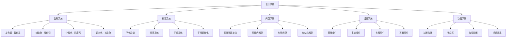
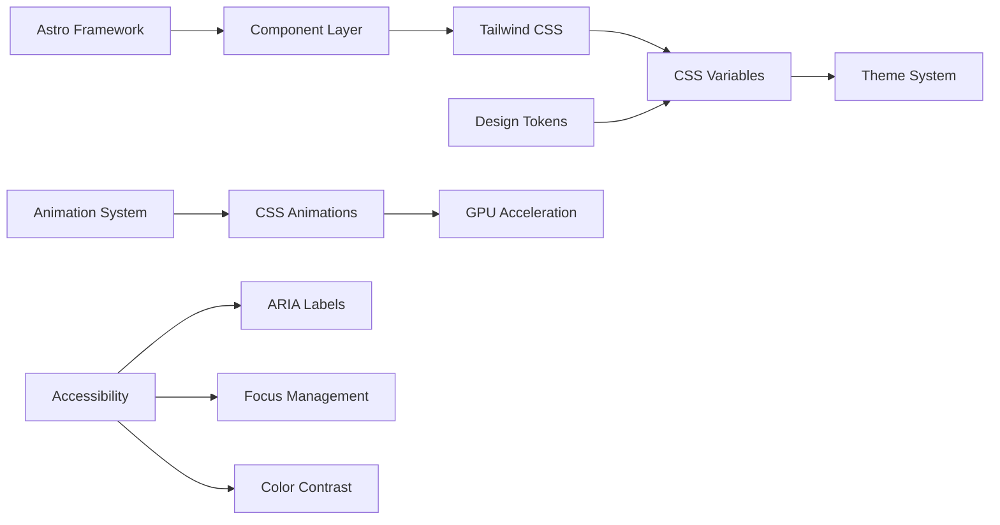

# Design Document

## Overview

本设计文档基于"优雅的极简主义美学与功能的完美平衡"的核心理念，为"我不知道的周刊"网站制定全面的视觉设计系统。设计将通过清新柔和的渐变配色、精心计算的留白比例、轻盈通透的玻璃态效果，以及细腻的微交互动画，创造出现代化、沉浸式的用户体验。

设计系统将基于现有的 Astro + Tailwind CSS 技术栈，通过 CSS 变量系统实现主题切换，并确保在所有设备和可访问性场景下的优秀表现。

## Architecture

### 设计系统架构



### 技术架构



## Components and Interfaces

### 核心设计组件

#### 1. 色彩系统 (Color System)

**主色调 - 蓝色系**
- Primary: `hsl(214, 88%, 62%)` - 主要交互元素
- Primary Hover: `hsl(214, 88%, 58%)` - 悬停状态
- Primary Soft: `hsl(214, 88%, 72%)` - 柔和变体
- Primary Muted: `hsl(214, 45%, 82%)` - 静音变体

**辅助色系**
- Accent Warm: `hsl(38, 95%, 68%)` - 温暖强调色
- Accent Cool: `hsl(198, 82%, 68%)` - 冷色强调色

**中性色系 - 增强层次**
- Background: `hsl(0, 0%, 100%)` / `hsl(220, 15%, 6%)`
- Surface: `hsl(214, 25%, 98%)` / `hsl(220, 15%, 8%)`
- Surface Elevated: `hsl(214, 30%, 96%)` / `hsl(220, 15%, 10%)`

#### 2. 排版系统 (Typography System)

**字体栈**
```css
font-family: 'LXGW WenKai', 'Inter', -apple-system, BlinkMacSystemFont, 'Segoe UI', Roboto, sans-serif;
```

**字体层级**
- Display: 4.5rem - 6rem (首页大标题)
- H1: 2.25rem - 3.75rem (页面标题)
- H2: 1.5rem - 2.25rem (章节标题)
- H3: 1.25rem - 1.875rem (小节标题)
- Body: 1rem - 1.125rem (正文)
- Caption: 0.875rem (辅助文字)

#### 3. 间距系统 (Spacing System)

**基础间距单位 (4px 基准)**
- xs: 0.25rem (4px)
- sm: 0.5rem (8px)
- md: 1rem (16px)
- lg: 1.5rem (24px)
- xl: 2rem (32px)
- 2xl: 3rem (48px)
- 3xl: 4rem (64px)

#### 4. 圆角系统 (Border Radius)

**统一圆角规范**
- sm: 0.375rem - 小元素
- md: 0.5rem - 按钮、输入框
- lg: 0.75rem - 卡片
- xl: 1rem - 大卡片
- 2xl: 1.5rem - 容器
- 3xl: 2rem - 大容器

#### 5. 阴影系统 (Shadow System)

**层次化阴影**
```css
--shadow-sm: 0 1px 2px 0 rgba(0, 0, 0, 0.05);
--shadow-md: 0 4px 6px -1px rgba(0, 0, 0, 0.1), 0 2px 4px -1px rgba(0, 0, 0, 0.06);
--shadow-lg: 0 10px 15px -3px rgba(0, 0, 0, 0.1), 0 4px 6px -2px rgba(0, 0, 0, 0.05);
--shadow-xl: 0 20px 25px -5px rgba(0, 0, 0, 0.1), 0 10px 10px -5px rgba(0, 0, 0, 0.04);
--shadow-2xl: 0 25px 50px -12px rgba(0, 0, 0, 0.25);
```

### 组件接口设计

#### Button 组件增强
```typescript
interface ButtonProps {
  variant: 'primary' | 'secondary' | 'tertiary' | 'ghost' | 'destructive' | 'link';
  size: 'sm' | 'md' | 'lg' | 'xl';
  gradient?: boolean; // 渐变效果
  glow?: boolean; // 发光效果
  shimmer?: boolean; // 微光效果
  loading?: boolean;
  disabled?: boolean;
  fullWidth?: boolean;
  icon?: string;
  iconPosition?: 'left' | 'right';
}
```

#### Card 组件系统
```typescript
interface CardProps {
  variant: 'default' | 'elevated' | 'glass' | 'gradient';
  padding: 'sm' | 'md' | 'lg' | 'xl';
  radius: 'md' | 'lg' | 'xl' | '2xl';
  shadow: 'sm' | 'md' | 'lg' | 'xl';
  hover?: boolean; // 悬停效果
  glow?: boolean; // 发光边框
  shimmer?: boolean; // 微光动画
}
```

## Data Models

### 设计令牌 (Design Tokens)

```typescript
interface DesignTokens {
  colors: {
    primary: ColorScale;
    secondary: ColorScale;
    accent: {
      warm: ColorScale;
      cool: ColorScale;
    };
    neutral: ColorScale;
    semantic: {
      success: ColorScale;
      warning: ColorScale;
      error: ColorScale;
      info: ColorScale;
    };
  };
  
  typography: {
    fontFamilies: FontFamily[];
    fontSizes: FontSizeScale;
    fontWeights: FontWeightScale;
    lineHeights: LineHeightScale;
    letterSpacing: LetterSpacingScale;
  };
  
  spacing: SpacingScale;
  borderRadius: BorderRadiusScale;
  shadows: ShadowScale;
  animations: AnimationTokens;
}

interface ColorScale {
  50: string;
  100: string;
  200: string;
  300: string;
  400: string;
  500: string; // base
  600: string;
  700: string;
  800: string;
  900: string;
  950: string;
}
```

### 主题配置模型

```typescript
interface ThemeConfig {
  mode: 'light' | 'dark' | 'auto';
  primaryColor: string;
  accentColors: {
    warm: string;
    cool: string;
  };
  customizations: {
    borderRadius: 'sharp' | 'rounded' | 'pill';
    animations: 'none' | 'reduced' | 'full';
    density: 'compact' | 'comfortable' | 'spacious';
  };
}
```

## Error Handling

### 样式降级策略

1. **CSS 特性检测**
   - 使用 `@supports` 查询检测现代 CSS 特性
   - 为不支持的浏览器提供降级方案

2. **动画降级**
   - 检测 `prefers-reduced-motion` 媒体查询
   - 为运动敏感用户禁用动画

3. **色彩对比度**
   - 检测 `prefers-contrast` 媒体查询
   - 为高对比度需求用户调整色彩

4. **字体加载失败**
   - 使用系统字体作为后备
   - 实现字体加载状态管理

### 性能优化策略

1. **CSS 优化**
   - 使用 CSS 变量减少重复
   - 启用 GPU 加速的动画
   - 优化选择器性能

2. **图像优化**
   - 响应式图像加载
   - WebP 格式支持
   - 懒加载实现

3. **动画性能**
   - 使用 `transform` 和 `opacity` 属性
   - 避免触发重排和重绘
   - 合理使用 `will-change` 属性

## Testing Strategy

### 视觉回归测试

1. **组件级测试**
   - 使用 Storybook 进行组件隔离测试
   - 截图对比测试确保视觉一致性

2. **页面级测试**
   - 关键页面的视觉回归测试
   - 不同设备尺寸的响应式测试

3. **主题切换测试**
   - 明暗主题切换的视觉验证
   - 色彩对比度合规性测试

### 可访问性测试

1. **自动化测试**
   - 使用 axe-core 进行可访问性扫描
   - 色彩对比度自动检测

2. **手动测试**
   - 键盘导航测试
   - 屏幕阅读器兼容性测试
   - 高对比度模式测试

3. **用户测试**
   - 不同能力用户的可用性测试
   - 认知负荷评估

### 性能测试

1. **加载性能**
   - CSS 文件大小监控
   - 首次内容绘制 (FCP) 优化
   - 累积布局偏移 (CLS) 控制

2. **运行时性能**
   - 动画帧率监控
   - 内存使用情况分析
   - 交互响应时间测试

3. **跨浏览器测试**
   - 主流浏览器兼容性验证
   - 移动设备性能测试
   - 网络条件模拟测试

### 实施计划

#### 阶段一：基础设计系统
- 色彩系统重构
- 排版系统优化
- 间距系统标准化
- 基础组件升级

#### 阶段二：高级视觉效果
- 玻璃态效果实现
- 微交互动画添加
- 渐变系统完善
- 阴影层次优化

#### 阶段三：响应式优化
- 移动端体验优化
- 触摸交互改进
- 性能优化实施
- 可访问性增强

#### 阶段四：测试与完善
- 全面测试执行
- 用户反馈收集
- 性能监控部署
- 文档完善