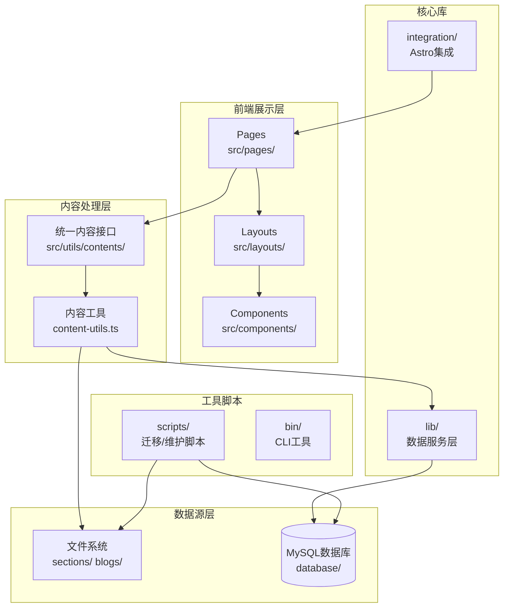

# Weekly - 我不知道的周刊

> 最后更新: 2026-01-13

## 项目概述

**Weekly** 是一个基于 Astro 框架构建的技术周刊网站，专注于前端技术内容的收集、整理和展示。项目支持双数据源（文件系统/MySQL数据库），提供周刊和博客两种内容类型。

- **网站地址**: https://weekly.mengpeng.tech
- **技术栈**: Astro 5.x + TypeScript + TailwindCSS + MySQL
- **内容格式**: MDX (Markdown + JSX)

## 架构总览



## 目录结构

```
weekly/
├── src/                    # 源代码目录
│   ├── pages/              # 页面路由
│   │   ├── index.astro     # 首页
│   │   ├── weekly/         # 周刊页面
│   │   └── blog/           # 博客页面
│   ├── components/         # UI组件
│   │   ├── ui/             # 基础UI组件
│   │   ├── common/         # 通用组件
│   │   ├── pages/          # 页面级组件
│   │   └── widgets/        # 小部件
│   ├── layouts/            # 布局模板
│   ├── utils/              # 工具函数
│   │   └── contents/       # 内容处理核心
│   ├── content/            # Astro内容配置
│   └── assets/             # 静态资源
├── lib/                    # 核心数据服务库
├── integration/            # Astro自定义集成
├── scripts/                # 工具脚本
├── sections/               # 周刊内容(MDX)
├── blogs/                  # 博客内容(MDX)
├── database/               # 数据库Schema
├── types/                  # TypeScript类型定义
├── config/                 # 配置文件
└── public/                 # 公共静态资源
```

## 模块索引

| 模块 | 路径 | 说明 | 本地文档 |
|------|------|------|----------|
| 源码核心 | `src/` | 页面、组件、工具函数 | [src/CLAUDE.md](src/CLAUDE.md) |
| 数据服务 | `lib/` | 数据库连接、缓存、内容服务 | [lib/CLAUDE.md](lib/CLAUDE.md) |
| Astro集成 | `integration/` | 自定义Astro集成插件 | [integration/CLAUDE.md](integration/CLAUDE.md) |
| 工具脚本 | `scripts/` | 数据迁移、维护脚本 | [scripts/CLAUDE.md](scripts/CLAUDE.md) |

## 核心概念

### 1. 双数据源架构

项目支持两种数据源，通过环境变量 `DATA_SOURCE` 切换：

- **filesystem**: 从 `sections/` 和 `blogs/` 目录读取 MDX 文件
- **database**: 从 MySQL 数据库读取内容

```typescript
// lib/data-source-config.ts
export function useDatabase(): boolean {
    return getDataSourceConfig().source === 'database';
}
```

### 2. 内容类型

| 类型 | 存储位置 | Schema | 说明 |
|------|----------|--------|------|
| 周刊 (Weekly) | `sections/YYYY-MM/*.mdx` | `types/weekly.ts` | 按周组织的技术内容 |
| 博客 (Blog) | `blogs/{category}/*.mdx` | `types/blog.ts` | 分类技术文章 |

### 3. 周刊分类

固定的分类顺序：`工具` → `文章` → `教程` → `言论` → `bug` → `面试题` → `repos` → `bigones` → `网站` → `prompt`

## 开发命令

```bash
# 开发模式
pnpm dev

# 构建
pnpm build

# 预览构建结果
pnpm preview

# 创建周刊条目
pnpm weekly:add

# 数据库迁移
pnpm migrate:mysql

# 数据库状态检查
pnpm db:check
```

> **注意**: 数据源通过环境变量 `DATA_SOURCE` 控制，设置为 `database` 使用数据库，否则默认使用文件系统。

## 关键文件

| 文件 | 说明 |
|------|------|
| `astro.config.ts` | Astro配置，集成Tailwind、MDX、Sentry等 |
| `src/config.yaml` | 站点配置（SEO、路由、主题等） |
| `src/content/config.ts` | Astro内容集合Schema定义 |
| `src/utils/contents/unified-content.ts` | 统一内容获取接口 |
| `lib/content-service.ts` | 数据库内容服务 |
| `database/schema.sql` | MySQL数据库Schema |

## 技术依赖

### 核心框架
- **Astro 5.x**: 静态站点生成器
- **TailwindCSS 3.x**: CSS框架
- **TypeScript 5.x**: 类型系统

### 内容处理
- **MDX**: Markdown + JSX
- **remark/rehype**: Markdown处理管道
- **gray-matter**: Frontmatter解析

### 数据存储
- **mysql2**: MySQL数据库驱动
- **node-cache**: 内存缓存

### 其他
- **dayjs**: 日期处理
- **Sentry**: 错误监控
- **Feed**: RSS生成

## 全局规范

### 代码风格
- 使用 TypeScript 严格模式
- 组件使用 `.astro` 扩展名
- 工具函数使用 `.ts` 扩展名
- 路径别名: `@/` → 项目根目录, `~/` → `src/`

### 内容规范
- 周刊内容按 `sections/YYYY-MM/` 目录组织
- 博客内容按 `blogs/{category}/` 目录组织
- 所有内容使用 MDX 格式
- Frontmatter 必须包含: `title`, `category`, `date`, `tags`

### Git提交
- 使用 Conventional Commits 规范
- 提交前运行 `pnpm cz` 使用交互式提交

## 覆盖率统计

| 类型 | 已扫描 | 估算总数 | 覆盖率 |
|------|--------|----------|--------|
| 源码文件 (src/) | 58 | 58 | 100% |
| 库文件 (lib/) | 10 | 10 | 100% |
| 脚本文件 (scripts/) | 15 | 15 | 100% |
| 集成文件 (integration/) | 4 | 4 | 100% |
| 周刊内容 (sections/) | - | 742 | 结构已识别 |
| 博客内容 (blogs/) | - | 91 | 结构已识别 |

**总计**: 约 1011 个文件（不含 node_modules）

## 建议下一步

1. **深入了解组件**: 查看 `src/components/` 了解UI组件实现
2. **内容处理流程**: 阅读 `src/utils/contents/weekly.ts` 了解周刊数据处理
3. **数据库服务**: 查看 `lib/content-service.ts` 了解数据库查询逻辑
4. **迁移脚本**: 查看 `scripts/migrate-to-mysql.ts` 了解数据迁移流程
