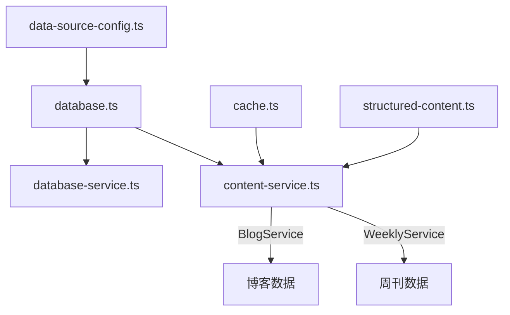

# lib/ - 核心数据服务库

[← 返回根目录](../CLAUDE.md)

> 最后更新: 2025-12-09T10:40:52+0800

## 目录概述

`lib/` 包含项目的核心数据服务层，负责数据库连接、缓存管理、内容服务等底层功能。

## 文件清单

| 文件 | 说明 | 依赖 |
|------|------|------|
| `data-source-config.ts` | 数据源配置管理 | - |
| `database.ts` | MySQL数据库连接池 | mysql2 |
| `database-service.ts` | 数据库服务封装 | database.ts |
| `content-service.ts` | 内容服务（博客/周刊） | database.ts, cache.ts |
| `cache.ts` | 内存缓存服务 | node-cache |
| `structured-content.ts` | 结构化内容解析 | - |
| `weekly.ts` | 周刊数据处理 | - |
| `blogs.ts` | 博客数据处理 | - |
| `tag.ts` | 标签处理 | - |
| `file.ts` | 文件操作工具 | fs |

## 核心模块

### 1. 数据源配置 (data-source-config.ts)

控制数据来源切换：

```typescript
// 数据源类型
export type DataSource = 'filesystem' | 'database';

// 检查是否使用数据库
export function useDatabase(): boolean {
    return getDataSourceConfig().source === 'database';
}

// 开发模式切换数据源
export function switchDataSource(source: DataSource) {
    if (process.env.NODE_ENV === 'development') {
        process.env.DATA_SOURCE = source;
    }
}
```

**环境变量**:
- `DATA_SOURCE`: `filesystem` | `database`
- `DB_HOST`, `DB_PORT`, `DB_USER`, `DB_PASSWORD`, `DB_NAME`

### 2. 数据库连接 (database.ts)

MySQL连接池管理：

```typescript
// 初始化连接池
export function initDatabase(): mysql.Pool

// 执行查询
export async function query<T>(sql: string, params?: any[]): Promise<T>

// 执行写操作
export async function execute(sql: string, params?: any[]): Promise<ResultSetHeader>

// 事务处理
export async function transaction<T>(callback: (conn) => Promise<T>): Promise<T>

// 工具类
export class DatabaseUtils {
    static async tableExists(tableName: string): Promise<boolean>
    static async getTableColumns(tableName: string): Promise<any[]>
    static async upsert(table, data, uniqueFields): Promise<{...}>
}
```

### 3. 内容服务 (content-service.ts)

提供博客和周刊的数据库查询服务：

```typescript
// 博客服务
export class BlogService {
    static async getBlogPosts(): Promise<Record<string, BlogPost[]>>
    static async getBlogPostBySlug(slug: string): Promise<BlogPost | null>
}

// 周刊服务
export class WeeklyService {
    static async getWeeklyPosts(): Promise<WeeklyPost[]>
}
```

### 4. 缓存服务 (cache.ts)

内存缓存，减少重复查询：

```typescript
export function getCachedData<T>(
    key: string,
    fetcher: () => Promise<T>,
    options?: { debug?: boolean; ttl?: number }
): Promise<T>
```

### 5. 结构化内容 (structured-content.ts)

解析和处理结构化内容：

```typescript
// 解析结构化内容
export function parseStructuredContent(content: string): StructuredContent

// 转换为纯文本
export function structuredContentToText(content: StructuredContent): string
```

## 依赖关系



## 使用示例

```typescript
// 在 src/utils/contents/unified-content.ts 中使用
import { useDatabase } from '@/lib/data-source-config';
import { BlogService, WeeklyService } from '@/lib/content-service';

export async function getBlogPosts() {
    if (useDatabase()) {
        return BlogService.getBlogPosts();
    } else {
        // 从文件系统获取
        const { getBlogPosts } = await import('./blog');
        return getBlogPosts();
    }
}
```

## 开发注意事项

1. **连接池**: 数据库使用连接池，无需手动管理连接
2. **缓存**: 查询结果会被缓存，开发时注意缓存失效
3. **事务**: 批量操作使用 `transaction()` 确保数据一致性
4. **类型安全**: 所有查询结果都有 TypeScript 类型定义
