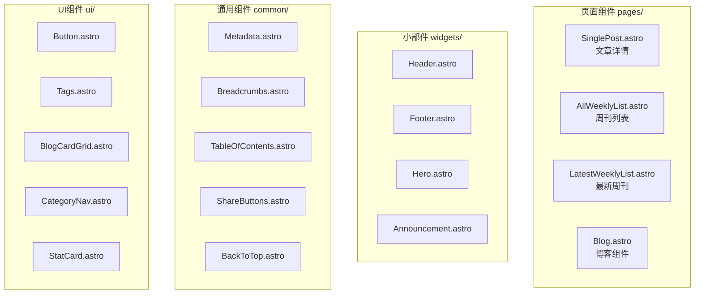

# src/ - 源代码目录

[← 返回根目录](../CLAUDE.md)

> 最后更新: 2025-12-09T10:40:52+0800

## 目录概述

`src/` 是项目的核心源代码目录，包含所有页面、组件、布局和工具函数。

## 目录结构

```
src/
├── pages/              # 页面路由（Astro文件路由）
│   ├── index.astro     # 首页
│   ├── 404.astro       # 404页面
│   ├── search.json.ts  # 搜索API端点
│   ├── weekly/         # 周刊页面
│   │   ├── index.astro # 周刊列表
│   │   └── [...slug].astro # 周刊详情
│   └── blog/           # 博客页面
│       ├── index.astro # 博客列表
│       └── [...slug].astro # 博客详情
├── components/         # UI组件
│   ├── ui/             # 基础UI组件
│   ├── common/         # 通用组件
│   ├── pages/          # 页面级组件
│   └── widgets/        # 小部件（Header/Footer等）
├── layouts/            # 布局模板
│   ├── Layout.astro    # 基础布局
│   └── PageLayout.astro # 页面布局
├── utils/              # 工具函数
│   └── contents/       # 内容处理核心
├── content/            # Astro内容配置
│   └── config.ts       # 内容集合Schema
├── assets/             # 静态资源
│   ├── favicons/       # 网站图标
│   └── styles/         # 样式文件
├── archive/            # 归档代码
├── config.yaml         # 站点配置
├── navigation.ts       # 导航配置
├── env.d.ts            # 环境类型声明
└── types.d.ts          # 全局类型声明
```

## 关键文件

### 页面入口

| 文件 | 路由 | 说明 |
|------|------|------|
| `pages/index.astro` | `/` | 首页，展示Hero和最新周刊 |
| `pages/weekly/index.astro` | `/weekly` | 周刊列表页 |
| `pages/weekly/[...slug].astro` | `/weekly/:slug` | 周刊详情页 |
| `pages/blog/index.astro` | `/blog` | 博客列表页 |
| `pages/blog/[...slug].astro` | `/blog/:slug` | 博客详情页 |

### 内容处理

| 文件 | 说明 |
|------|------|
| `utils/contents/unified-content.ts` | 统一内容获取接口，自动切换数据源 |
| `utils/contents/weekly.ts` | 周刊内容处理（文件系统） |
| `utils/contents/weekly-db.ts` | 周刊内容处理（数据库） |
| `utils/contents/blog.ts` | 博客内容处理（文件系统） |
| `utils/contents/blog-db.ts` | 博客内容处理（数据库） |
| `utils/contents/content-utils.ts` | 内容工具函数 |

### 工具函数

| 文件 | 说明 |
|------|------|
| `utils/permalinks.ts` | URL永久链接生成 |
| `utils/remark.ts` | Markdown处理管道 |
| `utils/images.ts` | 图片处理 |
| `utils/theme.ts` | 主题切换 |
| `utils/utils.ts` | 通用工具函数 |

## 组件架构



## 内容集合配置

```typescript
// content/config.ts
const weeklyCollection = defineCollection({
  loader: glob({ pattern: ['**/*.mdx'], base: 'sections' }),
  schema: () => z.object({
    title: z.string(),
    tags: z.array(z.string()).default([]),
    category: z.string(),
    source: z.string(),
    date: z.date(),
    wordCount: z.number().optional()
  })
})

const blogCollection = defineCollection({
  loader: glob({ pattern: ['**/*.mdx'], base: 'blogs' }),
  schema: () => z.object({
    title: z.string(),
    tags: z.array(z.string()).default([]),
    category: z.string(),
    date: z.date(),
    desc: z.string(),
    slug: z.string(),
    hidden: z.boolean().default(false).optional()
  })
})
```

## 路径别名

在 `tsconfig.json` 中配置：

- `~/` → `src/`
- `@/` → 项目根目录

## 开发注意事项

1. **页面组件**: 使用 `.astro` 扩展名，支持服务端渲染
2. **动态路由**: 使用 `[...slug].astro` 模式，需导出 `getStaticPaths`
3. **内容获取**: 优先使用 `unified-content.ts` 中的统一接口
4. **样式**: 使用 TailwindCSS，支持暗色模式
5. **SEO**: 使用 `Metadata.astro` 组件设置页面元数据
